# 5章　クラス分類：悪い回答を判別する

Q$Aサイトに焦点をあて，ある質問に対してあなたが回答を書く場面を想定．

回答を打ち込むとすぐに，その内容が良いものかどうか判定してくれる機能を追加したい．

これはQ&Aサイトで質問や回答の質を保つのに有用である．

## 5.1　本書のロードマップ

今回のシステムは，現実世界のデータを対象とする．つまりノイズが含まれることになり，100%の正解率を達成するのはとても困難である．

また回答の内容が良いか悪いかは人によって意見が分かれる事も問題を難しくしている．

## 5.2　良い回答を分類する

クラス分類を行う時にやるべきことは，与えられたデータに対して，対応するクラス（ラベル）を見つけることである．

クラス分けを行うためには，次の二つが必要である．

- データをどのように表現すべきか？
- 分類器はどのようなモデルまたは構造にすべきか？

### 5.2.2　データの表現方法

ここで扱うデータ

- 回答文書のテキストデータ
	- テキストデータをそのまま機械学習アルゴリズムで処理を扱うのは不適切であるので，有効な特徴量を抽出する必要がある．
- ラベル
	- 質問者がその回答を受理するかしないかという二値で表すことができる．

有効な特徴量があって初めて，機械学習アルゴリズムは正しいラベルを学習することができる．

### 5.2.2.　使用する分類器

十分なペアデータ（テキストとラベルのペア）を集めたら，分類器を訓練する事ができる．

どのような分類器を使うかはいろいろ考えることができるが，いくつか例を挙げておく．

- ロジスティクス回帰
- 決定木
- SVM
- ナイーブベイズ

## 5.3　データを用意する

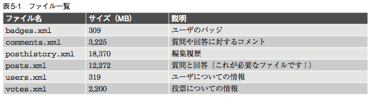

教科書に載っている[http://www.clearbits.net/ torrents/2076-aug-2012]( http://www.clearbits.net/ torrents/2076-aug-2012)ではデータをダウンロードすることができないので，[http://archive.org/details/stackexchange](http://archive.org/details/stackexchange)でダウンロードできる．

ファイルサイズが大きいので気をつけてください．fomalhautのwork/sakaizawa/MachineLearning/ch05/dataに入っています．

posts.xmlファイルには，postsというタグが一つ存在し，postsタグの中にはrowというタグが、質問と回答の数だけ存在する．一つの row タグには一つの質問もしくは回答が含まれます．例として次のXML データを見てみましょう．

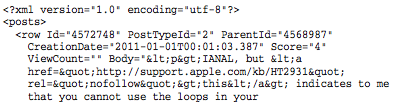
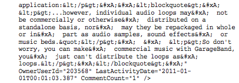

xml ファイルの属性については、表 5-2 の通りです．

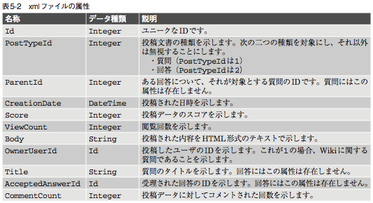

### 5.3.2　必要な属性の選別

ここでは，XMLファイルから良い回答を分類するために役立つ属性だけを残します．今回は太文字の特徴のみ残す．

- **Id**：回答をそれが対象とする質問に対応づけるために必要
- **PostTypeID**：その文書が回答か質問かを見分けるためにだけ必要．また，ParentId という属性が存在するかどうか確認するために，この属性を用いる．PostTypeIDが１のとき，文書タイプが質問である事を示す．
- **CreationDate**：文書(質問または回答)が投稿された日時を示す．
- **Score**：コミュニティからの評価を示す大切な指標
- ViewCount：投稿した時点ではどの回答も０になる
- **Body**：重要な情報を含んでいる
- OwnerUserId：今回は，文書が誰によって書かれたかということは考えないので必要なし
- Title：質問に対してより多くの情報を持っているが，今回は使用しない
- CommentCount：投稿時点で分類するため不要
- **AcceptedAnswerId**：Score属性と同じく，文書の質を示す指標として用いる．ここでは，各回答ごとにそれが受理された回答かどうか知りたいので，この属性を使うかわわりにIsAcceptedという新しい属性を追加する．この属性は，回答に対して0か1の値をもつ．

以上の考察から，投稿された文書は次のフォーマットに従うことにする．

Id (TAB) ParentId (TAB) IsAccepted (TAB) TimeToAnswer (TAB) Score (TAB) Text

具体的なパース(構文解析)の詳細については，so_xml_to_tsv.py と choose_instance.py を参照する．

### 5.3.3 良い回答を定義する

ここでは，訓練データの作成について議論する．

現状では，一塊のデータがあるだけなのでそれをラベルとひも付ける必要がある．

何を基準にラベル付けするか？

- IsAccepted（受理された回答かどうか示す）
	- 質問者の主観によってしまう
	- 最初に投稿されたものが良い回答となり，それ以降回答が増えても更新される可能性はすくない
- スコアの最も高い回答を良い例、最も低い回答を悪い例
	- 良い回答しか存在しない場合がある．（回答が二つで一つが２点，もう一つが４点など）
- スコアが０より大きい場合良い回答，小さい場合悪い回答（←今回はこれを採用する）

### 5.4.1 k近傍法

今回は自分で実装せずに，sklearn で用意されてあるツールキットを用いる．k 近傍法は sklearn.neighbors にあり，まずは k=2(近傍 2 点)から始める．

```
>>> from sklearn import neighbors
>>> knn = neighbors.KNeighborsClassifier(n_neighbors=2)
>>> print(knn)
KNeighborsClassifier(algorithm=auto, leaf_size=30, n_neighbors=2, p=2, warn_on_ equidistant=True, weights=uniform)
```

sklearn.neighborsは，sklearnに含まれる他の推定器と同じメソッドであるfit()， predict() を持つ．訓練を行うために fit() を用い，新しいデータに対しラベルを推測するために predict()を用いる．

次に示すコードは，その使用例である．


```
>>> train_data = [[1],[2],[3],[4],[5],[6]]
>>> train_label = [0,0,0,1,1,1]
>>> knn.fit(train_data, train_label)
>>> knn.predict(1.5)
array([0])
>>> knn.predict(37)
array([1])
>>> knn.predict(3) # 二つのデータへの距離が等しいため警告が出力されます NeighborsWarning: kneighbors: neighbor k+1 and neighbor k have the same distance: results will be dependent on data order.
neigh_dist, neigh_ind = self.kneighbors(X) array([0])
```

結果に対する確率を得るためには，predict_proba() を用いる．この場合，0 と 1 の二つのクラスがあり，それぞれのクラスに該当する確率が配列の形で返される．

```
>>> knn.predict_proba(1.5)
array([[ 1., 0.]])
>>> knn.predict_proba(37)
array([[ 0., 1.]])
>>> knn.predict_proba(3.5)
array([[ 0.5, 0.5]])
```

### 5.4.2 特徴量について

- 仮説
	- 文書中により多くの URL リンクが存在すればするほど，良い回答である可能性が高くなる
	- テキストデータ中に存在する「リンクの数」を用いる
	- 回答に対してソースコード中に含まれるリンク― 具体例としてソースコードを記載することもあるでしょう― は除外して，通常の文章中に含まれるリンクだけをカウントする

サンプルコード

```
import re
正規表現を用いて「ソースコード」と「URLリンク」を見つける
code_match = re.compile('<pre>(.*?)</pre>',
						re.MULTILINE|re.DOTALL)
link_match = re.compile('<a href="http://.*?".*?>(.*?)</a>',
						re.MULTILINE|re.DOTALL)
def extract_features_from_body(s):
	link_count_in_code = 0
	コード中に存在するリンクをカウントする
	for match_str in code_match.findall(s):
		link_count_in_code += len(link_match.findall(match_str))
	return len(link_match.findall(s)) - link_count_in_code
```

これで各回答ごとに一つの特徴量を抽出できた．分類器の訓練を行う前に，特徴量の性質・傾向を把握したいので，各文書の特徴量の値について，その値が全体に占める割合をプロットする（下図）．

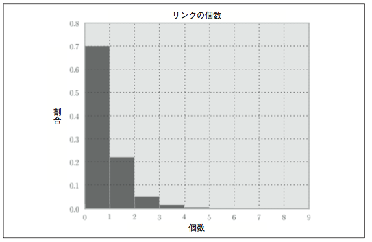

この図から，ほとんどの文書がリンクを持たないことがわかる．そのため，この特徴量だけからは良い分類器を作成することができない．しかし，ここではあえて，この特徴量だけから分類器を作成してみる．

### 5.4.3 分類器の訓練を行う

分類器の訓練を行うためには，先ほど定義したラベルの配列である Y と，対応する特徴量の配列を
一緒にして kNN 分類器に入力する．

```
X = np.asarray([extract_features_from_body(text) for post_id, text in fetch_posts() if post_id in all_answers])
knn = neighbors.KNeighborsClassifier() knn.fit(X, Y)
```

標準のパラメータを用いると，データに対して，k=5 つまり 5 近傍(5NN)でフィッティングを行う．

どのような k をとるかいいかはまだ議論できないので後述する．


### 5.4.4 分類器の評価を行う

最も簡単な評価方法

- テストデータに対して正しく予測した割合を計算することである．
- この値は 0 から 1 の間の値をとり，全て正しく予測した場合は 1 を，全て誤った 予測をした場合は 0 になる．

この値はつまるところ正解率(Accuracy)であり，knn.score() から求めることができる．

ここでは，交差検定(cross-validation)を用いる．交差検定を行うためには、 sklearn.cross_validation の KFold クラスを用いることができる．交差検定の各試行での正解率を平均して最終的な正解率を計算する．また，標準偏差も計算しそれぞれの正解率のばらつきについても見ることにする．

```
from sklearn.cross_validation import KFold
scores = []
cv = KFold(n=len(X), k=10, indices=True)
for train, test in cv:
	X_train, y_train = X[train], Y[train]
	X_test, y_test = X[test], Y[test]
	clf = neighbors.KNeighborsClassifier()
	clf.fit(X, Y)
	scores.append(clf.score(X_test, y_test))
print("Mean(scores)=%.5f\tStddev(scores)=%.5f"%(np.mean(scores, np.std(scores)))
Mean(scores)=0.49100 Stddev(scores)=0.02888
```

正解率49%では全然利用出来るレベルではない．

文書中にあるリンクの数だけでは文書の“質”を計測するための良い指標でないことは明らかになった．つまり，その特徴量は識別性がないと言えます(少なくとも k=5 と した時の kNN 分類器においては)．

### 5.4.5 より多くの特徴量をデザインする

新しく加える特徴量

- 文書中に含まれる「ソースコードの行数」
- 文書中のソースコード部分以外の単語の数

```
def extract_features_from_body(s):
	num_code_lines = 0
	link_count_in_code = 0
	code_free_s = s
	# ソースコードを取り除き、その行数を数える
	for match_str in code_match.findall(s):
		num_code_lines += match_str.count('\n')
		code_free_s = code_match.sub("", code_free_s)
		# ソースコードにはリンクが含まれることがあり、その場合はカウントしない link_count_in_code += 		len(link_match.findall(match_str))
	links = link_match.findall(s)
	link_count = len(links)
	link_count -= link_count_in_code
	html_free_s = re.sub(" +", " ", tag_match.sub('',
			code_free_s)).replace("\n", "") link_free_s = html_free_s
	# 単語の数をカウントする前にリンクを削除する
	for link in links:
		if link.lower().startswith("http://"):
			link_free_s = link_free_s.replace(link,'')
		num_text_tokens = html_free_s.count(" ")
	return num_text_tokens, num_code_lines, link_count
```

これまでと同様に各特徴量の傾向をグラフ化して確認すると，単語の数(NumTextTokens)のほうがソースコードの行数(NumCodeLines)よりも変化に富んでいることがわかる．

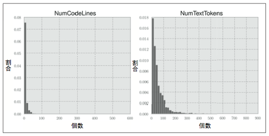

また、前と同じく正解率を計算する．結果は次のようになる．

Mean(scores)=0.58300 Stddev(scores)=0.02216

より多くの特徴量(より大きな特徴空間)を用いることで，少しだけ正解率を改善することができた．特徴量が多ければ多いほど，正解率は向上する― この考えに従い特徴量を追加する．

- AvgSentLen
	- これは 1 センテンスに含まれる単語数の平均を示す
- AvgWordLen
	- これは文書中の各単語について，その文字数の平均を示す．
- NumAllCaps
	- これは全ての文字が大文字で書かれている単語の数を示す．
- NumExclams
	- 感嘆符(「 ! 」)の数を示す．

グラフ化すると以下のようになる．

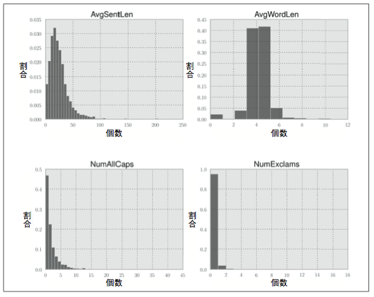

この 4 つの特徴量をさらに追加することで，各文書に対して全部で 7 つの特徴量を用いることになる．しかし，正解率は次のようなる．

Mean(scores)=0.57650 Stddev(scores)=0.03557

#### なぜ特徴量をふやして正解率が下がったのか？

現在の設定

- 新しい文書が入力される
- 7つの特徴量― LinkCount、 NumTextTokens、NumCodeLines、AvgSentLen、AvgWordLen、NumAllCaps、 NumExclams― が抽出される
- 他の文書の中から距離が近い順に5つの文書を選ぶ．
- 新しい文書が属するクラスは、5 つの近傍文書で最も多くを占めるクラスとなる（文書間の距離はユークリッド距離で計算）

ユークリッド距離の意味する事は，特徴量の 7 つの要素全てが同じように扱われることを意味する．

たとえば，2 つの文書 A・B があり，それらを新しい文書 New と比較する場合について考えてみる．

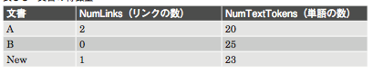

表からリンクの数が単語の数より重要な値である．そのため，新しい文書は文書 A のほうと似ているべきであると考えるが，今の手法では、文書 B のほうが新しい文書に似ていることになる．

以上の考察から、特徴量に異なる重さがかかるものに対して k 近傍方では上手く分類できないことがわかった．

## 5.5 改善案について考える

- データを追加する
	- 学習アルゴリズムにとってデータの数が十分ではないかもしれない．その場合は訓練データを追加する必要がある．
- モデルの複雑さを調整する
	- モデルが複雑すぎる，または複雑さが足りていない(単純すぎる) かもしれない．その場合、k 近傍法の k の値を調整する．k の値を増やせば，データに対してより均一な予測する，つまり複雑さを減らすことができる．k を減らせば，その逆を 行う．
- 特徴量を修正する
	- 適切な特徴量が得られていないかもしれない．たとえば，特徴量のスケー ルを変更したり，さらに新しい特徴量を追加することもできる．また現在使用している特徴量のうちでほとんど同じような特徴量があれば，それを用いないようにすることもできる．
- モデルを変更する
	- k 近傍法が今回のケースに適していないかもしれない．もしそうだとしたら，たとえどんなに複雑さを増やして，どんな洗練された特徴量をデザインしても良い予測は不可能．

これらのなかからどれを選択するか、、、以下の考え方について考えて答えを見つける場合がある．

### 5.5.1 バイアス - バリアンスのトレードオフ

- バイアス
	- 未学習(under-fitting)を指す
	- モデルが単純すぎて表現力が限定されている事に起因する．
	- データに対して**「バイアスが大きすぎる」**と表現する．

- バリアンス
	- 過学習(over-fitting)を指す．
	- モデルが複雑すぎることに起因する．
	- データに対して**「バリアンスが大きすぎる」**と表現する．

理想的には，バイアスとバリアンスを両方とも小さくしたいのですが，残念ながらこの二つはトレードオフの関係にある．つまり，どちらかを小さくすれば，もう片方が大きくなる．

###  5.5.2 バイアスが大きい場合の対処法

訓練データをいくら追加しても，正解率は改善されないのは明らかである．また，特徴量の数を減らしても改善されない．本質的な理由は**モデルが単純すぎるから**である．この場合，行うべきことは以下のどれかである．

- 特徴量を増やす
- モデルをより複雑なものにする
- モデルを変更する

###  5.5.3 バリアンスが大きい場合の対処法

この場合，行うべきことは以下のどれかである．

- より多くのデータを集める
- モデルの複雑さを減らす

モデルの複雑さを減らすとは，たとえば，k 近傍法において k の値を増加させることでより多くの近傍点を考慮にいれたり，特徴量の数を減らすこと指す．

### 5.5.4 バイアスは大きい? 小さい?

今自分達がが本当に問題としていることは何なのか？ それを知るために，データサイズを変化させたときの訓練データの誤差(訓練誤差)とテストデータの誤差(テスト誤差)をプロットする必要がある．

バイアスが大きい場合

- データサイズが大きくなるに連れて，訓練誤差とテスト誤差の値は共に大きい値に落ち着く．
- そして，データサイズの小さいときには，テスト誤差が少し減少する傾向にある．

バリアンスが大きい場合は，訓練誤差とテスト誤差の示すグラフの曲線に大きな隔たりがみえる．

5 近傍法(5NN)において，データサイズを増加した場合の訓練誤差とテスト誤差をプロットすると，以下のような図のグラフのようになる．

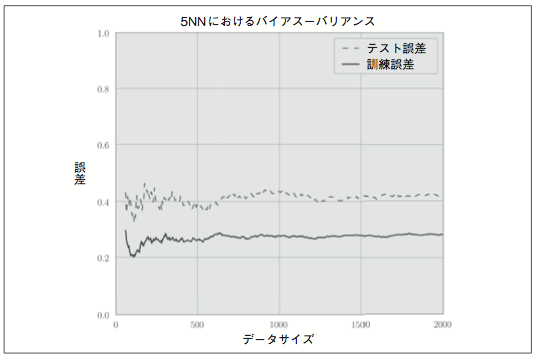

グラフからわかるように，二つの曲線には大きな隔たりがあることがわかる．つまり，これはバリアンスが大きいことが問題であることを示している．

また，グラフから訓練データを増やしても正解率は改善されていないことがわかる，

そのため，ここで行うべきことは次の二つのどちらかである．

- パラメータの k を大きくしてモデルの複雑さを減らすか
- 特徴量の次元を減らすか

##### 特徴量の次元を減らした場合

簡単な実験を行うことでどうなるか確かめることができる．簡単な実験とは，LinkCountと NumTextTokensの二つの特徴量だけを用いた場合で、同じようにプロットする。結果は以下の図のようなグラフになる．

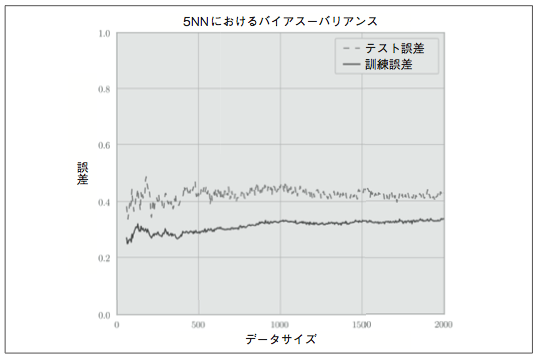

特徴量の次元を小さくしても，先ほどと同じようなグラフになった．これは，どのような特徴量の組み合わせを用いても，同じようなグラフになる．

##### パラメータ k の値を変化させる（モデルの複雑さを変化させる）

結果とプロットしたものを以下に示す．

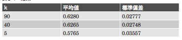

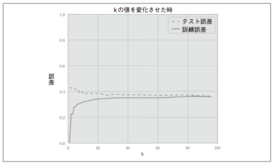

k を大きくすることで結果は良くなっているが，これで十分とはならない．

- k を大きくした場合，処理時間の問題が問題になってくる．
- たとえば k=90とした場合，テスト誤差を小さくできたとしても，新しい文書に対してそれが良い回答かどうか判定するためには、90 個の近傍点を見つける必要がある

k 近傍法には他にも問題(欠点)がある．

- 時間が経過するにつれて，投稿される文書の数が増え続けることに起因する．
- 事例に基づく(instance-based)学習であるため，訓練データとして用いたデータを常に保存しておく必要がある．
- そのため，文書の数が増えれば増えるほど，分類するために必要な時間が長くなることになる．


###### 今回のシナリオでは、k 近傍法を使うことには何かしら問題が伴うである　→　ロジスティクス回帰へ

## 5.6 ロジスティクス回帰

### 5.6.1 ロジスティクス回帰の簡単な例


ロジスティック回帰の仕組みを理解するために，ここでは以下の例について考えていく．用いるデータセットは人工的に生成したもので，各データは特徴量と対応するクラス(ラベル) を持つ．クラスは 0 か 1 のどちらかの値を取るものとする．ここで、X 軸に特徴量を Y 軸に対応 するクラスをとってプロットする．

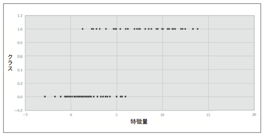

データの特徴

- データにはノイズが含まれている
- 特徴量が 1 から 6 の間では両方のクラスが存在している

そのため、0 か 1 の離散的な値を直接出力するような関数をモデル化するよりは，特徴量Xがクラス1に属する確率をP(X)として、その確率関数をモデル化したほうが良い．そのようにモデル化を行えば，P(X) が 0.5 より大きければクラス 1 に、それ以外であればクラス 0 に分類することができる．

##### オッズ比（ある事象の起きる確率(P)」と「ある事象が起きない確率(1 - P)」の比のこと→ P/(1-P)

ある関数について，その出力値がある決められた範囲(有限範囲，今回は０〜１)に収まるようにモデル化するためにオッズ比とその対数を用いる．


たとえば，ある特徴量について，それがクラス1に属する確率が0.9の場合，つまりP(y=1) = 0.9の場合を考える．この場合，オッズ比はP(y=1)/P(y=0) = 0.9/0.1 = 9になる．これは，この特徴量を持つデータは9:1の可能性でクラス1に属する，ということを意味する．もし P(y=0.5) であれば，1:1 の可能性になる．オッズ比が取りうる値の範囲は 0 から無限大である(下図の左部分を参照)．今ここで，このオッズ比についてその対数をとれば，確率値が 0 から 1 をとる場合，それをマイナス無限大からプラス無限大までの範囲に変換することができる(下図の右部分を参照)．

この良い点としては，確率値(P)が大きくなるに従い，その対数の値も大きくなるという関連性が保たれていることである．そして，逆関数として考えると，それはマイナス無限大からプラス無限大までの範囲を，0 から 1 までの有限範囲に変換する関数になる．

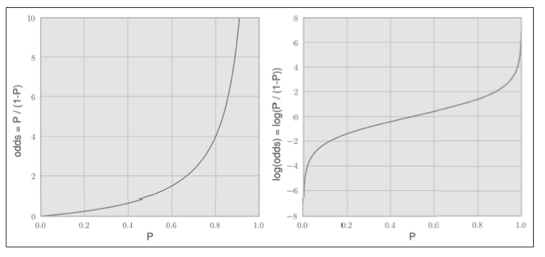

次に，特徴量の線形な組み合わせ― ここでは特徴量は1次元だが，後ほど次元数の大きい場合を見ていく― をlog(odds)の値にフィッティングさせることを考える．特徴量の線形な組み合わせについては，1章 で考察した，次の線形方程式を用いる．

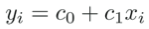

y を log(odds) に 置 き 換 え

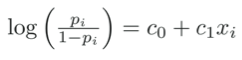

Pi について解を求める

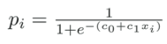

データセットの全てのペアデータ(xi, pi) に対して，誤差が最小となるような係数(c0 と c1)を求めれば完成．これは，scikit-learn を用いることで，この作業を簡単に行うことができる．

```
>>> from sklearn.linear_model import LogisticRegression
>>> clf = LogisticRegression()
>>> print(clf)
LogisticRegression(C=1.0, class_weight=None, dual=False, fit_ intercept=True, intercept_scaling=1, penalty=l2, tol=0.0001)

>>> clf.fit(X, y)
>>> print(np.exp(clf.intercept_), np.exp(clf.coef_.ravel()))
[ 0.09437188] [ 1.80094112]


>>> def lr_model(clf, X):
... 	return 1 / (1 + np.exp(-(clf.intercept_ + clf.coef_*X)))
>>> print("P(x=-1)=%.2f\tP(x=7)=%.2f"%(lr_model(clf, -1), lr_model(clf, 7)))
P(x=-1)=0.05 P(x=7)=0.85
```

ここでは、intercept_ という特別な変数を使って，最初の係数(c0)にアクセスできる．


フィッティングを行ったモデルをグラフに描画すると，下図のようになり，データに上手く適 合していることがわかる．

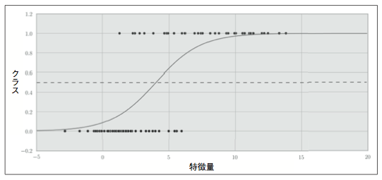

### 5.6.2 ロジスティック回帰を今回の問題に適用する

先ほど見た例は，ロジスティック回帰の美しさを見てもらうために人工的に用意したもので，実際のノイズが含まれるこれまで扱ってきたデータに対してはどのような結果になるのでしょうか?

結果は以下の表に示す．ただし，"C"は、ロジスティック回帰で正規化を行うためのパラメータを表し，これを調節することでモデルの複雑さを制御することができる（k 近傍法におけるパラメータ k と同じ役割）．C の値を小さくすると，モデルは より複雑になる．

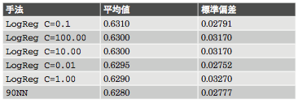

c = 0.1の結果を以下にプロットする．

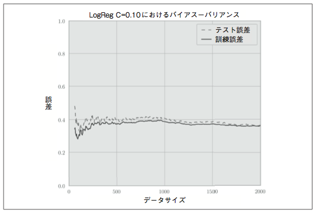

これにより，モデルはバイアスが大きいことがわかる．なぜなら，テスト誤差と訓練誤差を示す線は互いに近づいているが，共に大きな値(Error が 0.4 を前後している)をとっているからですある．よって，現在の特徴量に対するロジスティック回帰は未学習であり，データを正しく捉えることができていないと言える．

原因

- データにノイズが含まれすぎている
- 特徴量がクラスを正しく分類できるだけの能力を備えていない

### 5.7 適合率-再現率曲線

適切な閾値を求めるために使用．

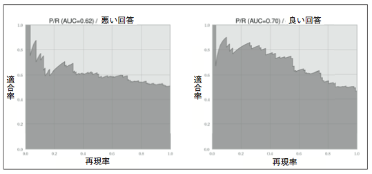

### 5.8 分類器をスリムにする

ロジスティック回帰の場合，各特徴量がどれだけ分類に貢献しているかを，学習した結果である回帰係数(clf.coef_)で直接確認することができる（下図）．

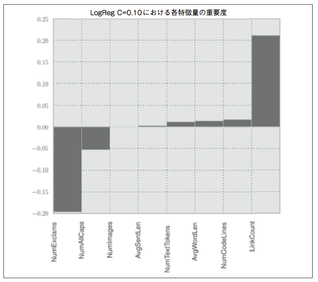

### 5.9 完成

毎回学習するのは時間がかかるので完成した分類器をシリアライズしておくとよい．

```
>>> import pickle
>>> pickle.dump(clf, open("logreg.dat", "w"))
>>> clf = pickle.load(open("logreg.dat", "r"))
```

### 5.10 まとめ

今回は以下のことを確認していった．

- 二つの手法の長所・欠点
- 特徴量の抽出方法，それぞれが分類にどれだけ貢献しているか
- 分類器の性能が悪い場合の，それを改善する方法論